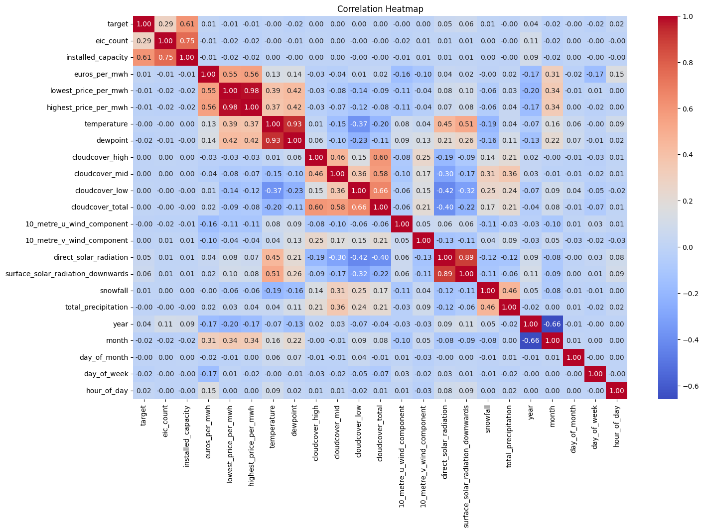
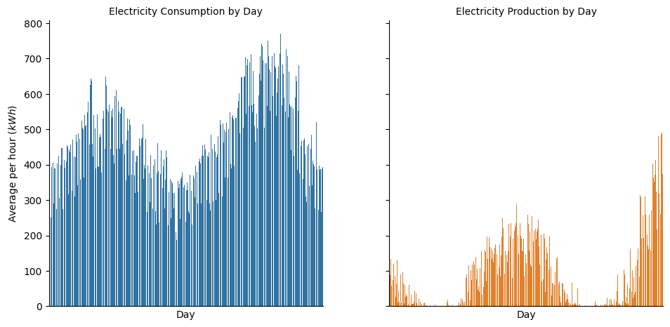
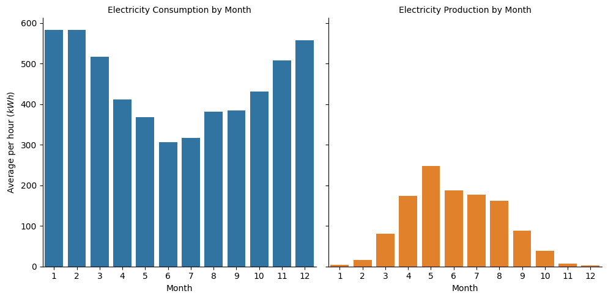
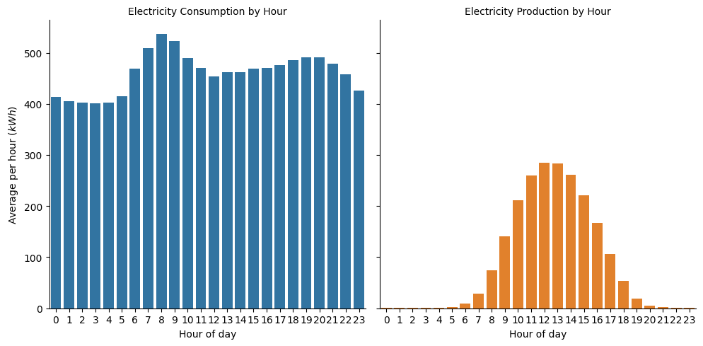
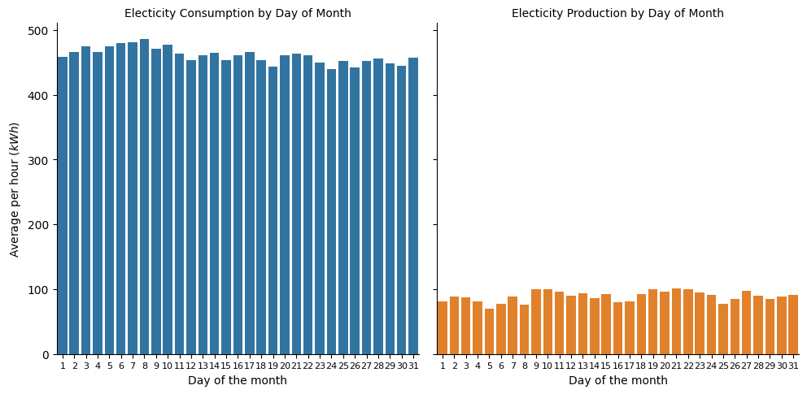
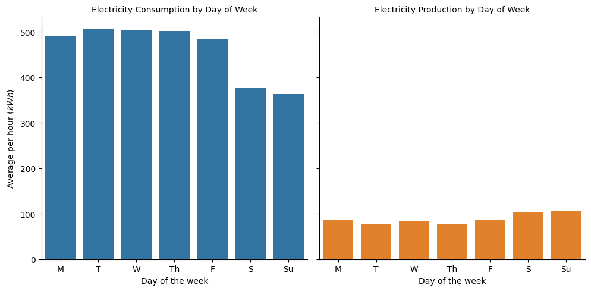
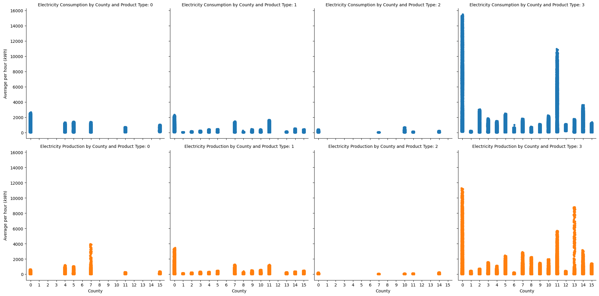
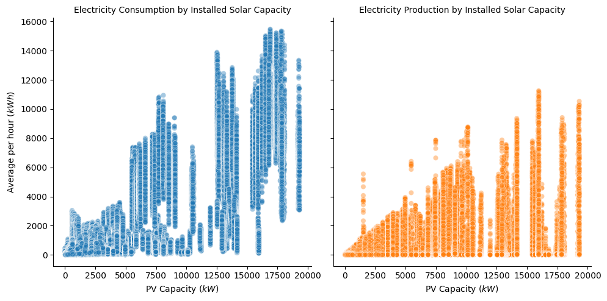

### **Data Description**

**Variable definitions**


train.csv
*   *target* - The consumption or production amount for the relevant segment for the hour. The segments are defined by the county, is_business, and product_type.

*   *is_consumption* - Boolean for whether or not this row's target is consumption or production.

*   *county* - An ID code for the county.

*   *is_business* - Boolean for whether or not the prosumer is a business

*   *product_type* - ID code with the following mapping of codes to contract types: {0: "Combined", 1: "Fixed", 2: "General service", 3: "Spot"}.

*   *prediction_unit_id* - A unique identifier for the county, is_business, and product_type combination.

*   *datetime* - The Estonian time in EET (UTC+2) / EEST (UTC+3). It describes the start of the 1-hour period on which target is given.

---

client.csv
*   *product_type*

*   *county* - An ID code for the county. See county_id_to_name_map.json for the mapping of ID codes to county names.

*   *eic_count* - The aggregated number of consumption points (EICs - European Identifier Code).

*   *installed_capacity* - Installed photovoltaic solar panel capacity in kilowatts.

*   *is_business* - Boolean for whether or not the prosumer is a business.
date

*   *date*

---

gas_prices.csv
*   *origin_date* - The date when the day-ahead prices became available.

*   *forecast_date* - The date when the forecast prices should be relevant.

*   *(lowest/highest)_price_per_mwh* - The lowest/highest price of natural gas that on the day ahead market that trading day, in Euros per megawatt hour equivalent.

---

electricity_prices.csv
*   *origin_date*

*   *forecast_date* - Represents the start of the 1-hour period when the price is valid

*   *euros_per_mwh* - The price of electricity on the day ahead markets in euros per megawatt hour.

---

forecast_weather.csv - Sourced from the European Centre for Medium-Range Weather Forecasts.
*   *(latitude/longitude)* - The coordinates of the weather forecast.

*   *origin_datetime* - The timestamp of when the forecast was generated.

*   *hours_ahead* - The number of hours between the forecast generation and the forecast weather. Each forecast covers 48 hours in total.

*   *temperature* - The air temperature at 2 meters above ground in degrees Celsius. Estimated for the end of the 1-hour period.

*   *dewpoint* - The dew point temperature at 2 meters above ground in degrees Celsius. Estimated for the end of the 1-hour period.

*   *cloudcover_(low/mid/high/total)* - The percentage of the sky covered by clouds in the following altitude bands: 0-2 km, 2-6, 6+, and total. Estimated for the end of the 1-hour period.

*   *10_metre_(u/v)_wind_component* - The [eastward/northward] component of wind speed measured 10 meters above surface in meters per second. Estimated for the end of the 1-hour period.

*   *forecast_datetime* - The timestamp of the predicted weather. Generated from origin_datetime plus hours_ahead. This represents the start of the 1-hour period for which weather data are forecasted.

*   *direct_solar_radiation* - The direct solar radiation reaching the surface on a plane perpendicular to the direction of the Sun accumulated during the hour, in watt-hours per square meter.

*   *surface_solar_radiation_downwards* - The solar radiation, both direct and diffuse, that reaches a horizontal plane at the surface of the Earth, accumulated during the hour, in watt-hours per square meter.

*   *snowfall* - Snowfall over hour in units of meters of water equivalent.

*   *total_precipitation* - The accumulated liquid, comprising rain and snow that falls on Earth's surface over the described hour, in units of meters.

### **Data Wrangling**


```python
import numpy as np
import pandas as pd
import matplotlib as mpl
import matplotlib.pyplot as plt
import seaborn as sns
import sys
from google.colab import drive

# Mount Google Drive
drive.mount('/content/drive')
```

    Drive already mounted at /content/drive; to attempt to forcibly remount, call drive.mount("/content/drive", force_remount=True).
    


```python
print("Python version: ", sys.version)
print("NumPy version:", np.__version__)
print("Pandas version:", pd.__version__)
print("Matplotlib version:", mpl.__version__)
print("Seaborn version:", sns.__version__)
```

    Python version:  3.10.12 (main, Nov 20 2023, 15:14:05) [GCC 11.4.0]
    NumPy version: 1.23.5
    Pandas version: 1.5.3
    Matplotlib version: 3.7.1
    Seaborn version: 0.13.1
    


```python
def load_datasets():
    """Load datasets from csv files."""
    folder_path = '/content/drive/MyDrive/Prosumer-energy-data/'
    train = pd.read_csv(folder_path + 'train.csv')
    client = pd.read_csv(folder_path + 'client.csv')
    electricity = pd.read_csv(folder_path + 'electricity_prices.csv')
    gas = pd.read_csv(folder_path + 'gas_prices.csv')
    forecast_weather = pd.read_csv(folder_path + 'forecast_weather.csv')
    weather_to_county = pd.read_csv(folder_path + 'weather_station_to_county_mapping.csv')
    return train, client, electricity, gas, forecast_weather, weather_to_county

train, client, electricity, gas, forecast_weather, weather_to_county = load_datasets()
```


```python
def clean_data(train, client, electricity, gas):
    """Clean non-weather data."""
    train.drop(columns=['row_id'], inplace=True)
    train['datetime'] = pd.to_datetime(train['datetime'])
    train['date'] = train['datetime'].dt.date
    train['is_consumption'] = train['is_consumption'].replace({0: 'Production', 1: 'Consumption'})

    electricity.drop(columns=['data_block_id', 'origin_date'], inplace=True)
    electricity['forecast_date'] = pd.to_datetime(electricity['forecast_date'])

    gas.drop(columns=['origin_date', 'data_block_id'], inplace=True)
    gas['forecast_date'] = pd.to_datetime(gas['forecast_date']).dt.date

    client.drop(columns='date', inplace=True)
    return train, client, electricity, gas

train, client, electricity, gas = clean_data(train, client, electricity, gas)
```


```python
def clean_weather_data(forecast_weather, weather_to_county):
    """Clean weather data and prepare to merge."""
    forecast_weather['forecast_datetime'] = pd.to_datetime(forecast_weather['forecast_datetime'])
    forecast_weather = forecast_weather[forecast_weather['hours_ahead'] <= 24].copy()
    forecast_weather[['latitude', 'longitude']] = forecast_weather[['latitude', 'longitude']].round(1)
    weather_to_county[['latitude', 'longitude']] = weather_to_county[['latitude', 'longitude']].round(1)
    weather_to_county.drop(columns='county_name', inplace=True)
    return forecast_weather, weather_to_county

forecast_weather, weather_to_county = clean_weather_data(forecast_weather, weather_to_county)
```


```python
def merge_weather_with_county(forecast_weather, weather_to_county):
    """Merge weather data with county mapping."""
    forecast_weather_by_county = forecast_weather.merge(weather_to_county, how='left', on=['latitude', 'longitude'])
    return forecast_weather_by_county

forecast_weather_by_county = merge_weather_with_county(forecast_weather, weather_to_county)
```


```python
def average_weather_data(forecast_weather_county):
    """Calculate average weather data for each county."""
    columns_to_average = ['temperature', 'dewpoint', 'cloudcover_high', 'cloudcover_mid',
                         'cloudcover_low', 'cloudcover_total', '10_metre_u_wind_component',
                         '10_metre_v_wind_component', 'direct_solar_radiation',
                         'surface_solar_radiation_downwards', 'snowfall', 'total_precipitation']
    avg_forecast_weather = forecast_weather_county.groupby(['county', 'forecast_datetime'])[columns_to_average].mean().reset_index()
    avg_forecast_weather['county'] = avg_forecast_weather['county'].astype(int)
    return avg_forecast_weather

avg_forecast_weather = average_weather_data(forecast_weather_by_county)
```


```python
def merge_all_data(train, client, electricity, gas, avg_forecast_weather):
    """Merge cleaned data with forecasted weather data."""
    merged_df = train.merge(client, how='left', on=['data_block_id', 'county', 'product_type', 'is_business']).drop(columns='data_block_id')
    merged_df = merged_df.merge(electricity, how='left', left_on='datetime', right_on='forecast_date').drop(columns='forecast_date')
    merged_df = merged_df.merge(gas, how='left', left_on='date', right_on='forecast_date').drop(columns=['forecast_date'])
    whole_df = merged_df.merge(avg_forecast_weather, how='left', left_on=['county', 'datetime'], right_on=['county', 'forecast_datetime']).drop(columns='forecast_datetime')
    return whole_df

df = merge_all_data(train, client, electricity, gas, avg_forecast_weather)
```


```python
def edit_variable_datatypes(df):
    """Changes the dataframe's categorical variables to the correct datatype."""
    df['county'] = df['county'].astype('category')
    df['is_business'] = df['is_business'].astype('category')
    df['product_type'] = df['product_type'].astype('category')
    df['prediction_unit_id'] = df['prediction_unit_id'].astype('category')
    df['is_consumption'] = df['is_consumption'].astype('category')
    return df

df = edit_variable_datatypes(df)
```


```python
def create_time_series_features(df):
    """Creates time-series relevant features such as month, day, hour, etc."""
    df['year'] = df['datetime'].dt.year
    df['month'] = df['datetime'].dt.month
    df['day_of_month'] = df['datetime'].dt.day
    df['day_of_week'] = df['datetime'].dt.dayofweek
    df['hour_of_day'] = df['datetime'].dt.hour
    return df

df = create_time_series_features(df)
```


```python
df.shape
```


    (2018352, 30)


```python
pd.set_option('display.float_format', lambda x: '%.2f' % x)
df.describe().transpose()
```


  <div id="df-c3ac59dc-0b4d-428b-b2b0-12d39eed2464" class="colab-df-container">
    <div>
<style scoped>
    .dataframe tbody tr th:only-of-type {
        vertical-align: middle;
    }

    .dataframe tbody tr th {
        vertical-align: top;
    }

    .dataframe thead th {
        text-align: right;
    }
</style>
<table border="1" class="dataframe">
  <thead>
    <tr style="text-align: right;">
      <th></th>
      <th>target</th>
      <th>eic_count</th>
      <th>installed_capacity</th>
      <th>euros_per_mwh</th>
      <th>lowest_price_per_mwh</th>
      <th>highest_price_per_mwh</th>
      <th>temperature</th>
      <th>dewpoint</th>
      <th>cloudcover_high</th>
      <th>cloudcover_mid</th>
      <th>...</th>
      <th>10_metre_v_wind_component</th>
      <th>direct_solar_radiation</th>
      <th>surface_solar_radiation_downwards</th>
      <th>snowfall</th>
      <th>total_precipitation</th>
      <th>year</th>
      <th>month</th>
      <th>day_of_month</th>
      <th>day_of_week</th>
      <th>hour_of_day</th>
    </tr>
  </thead>
  <tbody>
    <tr>
      <th>count</th>
      <td>2017824.00</td>
      <td>2009712.00</td>
      <td>2009712.00</td>
      <td>2014966.00</td>
      <td>2015232.00</td>
      <td>2015232.00</td>
      <td>1984418.00</td>
      <td>1984418.00</td>
      <td>1984418.00</td>
      <td>1984418.00</td>
      <td>...</td>
      <td>1984418.00</td>
      <td>1984418.00</td>
      <td>1984418.00</td>
      <td>1984418.00</td>
      <td>1984418.00</td>
      <td>2018352.00</td>
      <td>2018352.00</td>
      <td>2018352.00</td>
      <td>2018352.00</td>
      <td>2018352.00</td>
    </tr>
    <tr>
      <th>mean</th>
      <td>274.86</td>
      <td>73.43</td>
      <td>1452.34</td>
      <td>157.43</td>
      <td>95.46</td>
      <td>108.30</td>
      <td>5.33</td>
      <td>1.84</td>
      <td>0.40</td>
      <td>0.37</td>
      <td>...</td>
      <td>0.73</td>
      <td>142.14</td>
      <td>107.85</td>
      <td>0.00</td>
      <td>0.00</td>
      <td>2022.06</td>
      <td>6.43</td>
      <td>15.70</td>
      <td>3.00</td>
      <td>11.50</td>
    </tr>
    <tr>
      <th>std</th>
      <td>909.50</td>
      <td>144.13</td>
      <td>2423.21</td>
      <td>121.34</td>
      <td>47.58</td>
      <td>54.76</td>
      <td>8.33</td>
      <td>7.31</td>
      <td>0.43</td>
      <td>0.40</td>
      <td>...</td>
      <td>3.12</td>
      <td>242.36</td>
      <td>181.40</td>
      <td>0.00</td>
      <td>0.00</td>
      <td>0.65</td>
      <td>3.66</td>
      <td>8.79</td>
      <td>2.00</td>
      <td>6.92</td>
    </tr>
    <tr>
      <th>min</th>
      <td>0.00</td>
      <td>5.00</td>
      <td>6.00</td>
      <td>-10.06</td>
      <td>28.10</td>
      <td>34.00</td>
      <td>-25.12</td>
      <td>-27.28</td>
      <td>0.00</td>
      <td>0.00</td>
      <td>...</td>
      <td>-14.11</td>
      <td>-0.38</td>
      <td>-0.16</td>
      <td>-0.00</td>
      <td>-0.00</td>
      <td>2021.00</td>
      <td>1.00</td>
      <td>1.00</td>
      <td>0.00</td>
      <td>0.00</td>
    </tr>
    <tr>
      <th>25%</th>
      <td>0.38</td>
      <td>14.00</td>
      <td>323.70</td>
      <td>85.29</td>
      <td>60.00</td>
      <td>67.67</td>
      <td>-0.68</td>
      <td>-3.16</td>
      <td>0.00</td>
      <td>0.00</td>
      <td>...</td>
      <td>-1.45</td>
      <td>0.00</td>
      <td>0.00</td>
      <td>0.00</td>
      <td>0.00</td>
      <td>2022.00</td>
      <td>3.00</td>
      <td>8.00</td>
      <td>1.00</td>
      <td>5.75</td>
    </tr>
    <tr>
      <th>50%</th>
      <td>31.13</td>
      <td>32.00</td>
      <td>647.08</td>
      <td>128.67</td>
      <td>85.90</td>
      <td>94.00</td>
      <td>4.74</td>
      <td>1.37</td>
      <td>0.18</td>
      <td>0.17</td>
      <td>...</td>
      <td>0.89</td>
      <td>0.00</td>
      <td>0.71</td>
      <td>0.00</td>
      <td>0.00</td>
      <td>2022.00</td>
      <td>6.00</td>
      <td>16.00</td>
      <td>3.00</td>
      <td>11.50</td>
    </tr>
    <tr>
      <th>75%</th>
      <td>180.21</td>
      <td>70.00</td>
      <td>1567.15</td>
      <td>199.97</td>
      <td>109.19</td>
      <td>133.00</td>
      <td>10.98</td>
      <td>6.79</td>
      <td>0.93</td>
      <td>0.83</td>
      <td>...</td>
      <td>2.94</td>
      <td>196.25</td>
      <td>142.57</td>
      <td>0.00</td>
      <td>0.00</td>
      <td>2022.00</td>
      <td>10.00</td>
      <td>23.00</td>
      <td>5.00</td>
      <td>17.25</td>
    </tr>
    <tr>
      <th>max</th>
      <td>15480.27</td>
      <td>1517.00</td>
      <td>19314.31</td>
      <td>4000.00</td>
      <td>250.00</td>
      <td>305.00</td>
      <td>31.58</td>
      <td>21.70</td>
      <td>1.00</td>
      <td>1.00</td>
      <td>...</td>
      <td>12.45</td>
      <td>919.72</td>
      <td>828.65</td>
      <td>0.00</td>
      <td>0.01</td>
      <td>2023.00</td>
      <td>12.00</td>
      <td>31.00</td>
      <td>6.00</td>
      <td>23.00</td>
    </tr>
  </tbody>
</table>
<p>8 rows × 23 columns</p>
</div>
    <div class="colab-df-buttons">

  <div class="colab-df-container">
    <button class="colab-df-convert" onclick="convertToInteractive('df-c3ac59dc-0b4d-428b-b2b0-12d39eed2464')"
            title="Convert this dataframe to an interactive table."
            style="display:none;">

  <svg xmlns="http://www.w3.org/2000/svg" height="24px" viewBox="0 -960 960 960">
    <path d="M120-120v-720h720v720H120Zm60-500h600v-160H180v160Zm220 220h160v-160H400v160Zm0 220h160v-160H400v160ZM180-400h160v-160H180v160Zm440 0h160v-160H620v160ZM180-180h160v-160H180v160Zm440 0h160v-160H620v160Z"/>
  </svg>
    </button>

  <style>
    .colab-df-container {
      display:flex;
      gap: 12px;
    }

    .colab-df-convert {
      background-color: #E8F0FE;
      border: none;
      border-radius: 50%;
      cursor: pointer;
      display: none;
      fill: #1967D2;
      height: 32px;
      padding: 0 0 0 0;
      width: 32px;
    }

    .colab-df-convert:hover {
      background-color: #E2EBFA;
      box-shadow: 0px 1px 2px rgba(60, 64, 67, 0.3), 0px 1px 3px 1px rgba(60, 64, 67, 0.15);
      fill: #174EA6;
    }

    .colab-df-buttons div {
      margin-bottom: 4px;
    }

    [theme=dark] .colab-df-convert {
      background-color: #3B4455;
      fill: #D2E3FC;
    }

    [theme=dark] .colab-df-convert:hover {
      background-color: #434B5C;
      box-shadow: 0px 1px 3px 1px rgba(0, 0, 0, 0.15);
      filter: drop-shadow(0px 1px 2px rgba(0, 0, 0, 0.3));
      fill: #FFFFFF;
    }
  </style>

    <script>
      const buttonEl =
        document.querySelector('#df-c3ac59dc-0b4d-428b-b2b0-12d39eed2464 button.colab-df-convert');
      buttonEl.style.display =
        google.colab.kernel.accessAllowed ? 'block' : 'none';

      async function convertToInteractive(key) {
        const element = document.querySelector('#df-c3ac59dc-0b4d-428b-b2b0-12d39eed2464');
        const dataTable =
          await google.colab.kernel.invokeFunction('convertToInteractive',
                                                    [key], {});
        if (!dataTable) return;

        const docLinkHtml = 'Like what you see? Visit the ' +
          '<a target="_blank" href=https://colab.research.google.com/notebooks/data_table.ipynb>data table notebook</a>'
          + ' to learn more about interactive tables.';
        element.innerHTML = '';
        dataTable['output_type'] = 'display_data';
        await google.colab.output.renderOutput(dataTable, element);
        const docLink = document.createElement('div');
        docLink.innerHTML = docLinkHtml;
        element.appendChild(docLink);
      }
    </script>
  </div>


<div id="df-ef6e603b-7878-4e4c-8e38-6ba02748b04a">
  <button class="colab-df-quickchart" onclick="quickchart('df-ef6e603b-7878-4e4c-8e38-6ba02748b04a')"
            title="Suggest charts"
            style="display:none;">

<svg xmlns="http://www.w3.org/2000/svg" height="24px"viewBox="0 0 24 24"
     width="24px">
    <g>
        <path d="M19 3H5c-1.1 0-2 .9-2 2v14c0 1.1.9 2 2 2h14c1.1 0 2-.9 2-2V5c0-1.1-.9-2-2-2zM9 17H7v-7h2v7zm4 0h-2V7h2v10zm4 0h-2v-4h2v4z"/>
    </g>
</svg>
  </button>

<style>
  .colab-df-quickchart {
      --bg-color: #E8F0FE;
      --fill-color: #1967D2;
      --hover-bg-color: #E2EBFA;
      --hover-fill-color: #174EA6;
      --disabled-fill-color: #AAA;
      --disabled-bg-color: #DDD;
  }

  [theme=dark] .colab-df-quickchart {
      --bg-color: #3B4455;
      --fill-color: #D2E3FC;
      --hover-bg-color: #434B5C;
      --hover-fill-color: #FFFFFF;
      --disabled-bg-color: #3B4455;
      --disabled-fill-color: #666;
  }

  .colab-df-quickchart {
    background-color: var(--bg-color);
    border: none;
    border-radius: 50%;
    cursor: pointer;
    display: none;
    fill: var(--fill-color);
    height: 32px;
    padding: 0;
    width: 32px;
  }

  .colab-df-quickchart:hover {
    background-color: var(--hover-bg-color);
    box-shadow: 0 1px 2px rgba(60, 64, 67, 0.3), 0 1px 3px 1px rgba(60, 64, 67, 0.15);
    fill: var(--button-hover-fill-color);
  }

  .colab-df-quickchart-complete:disabled,
  .colab-df-quickchart-complete:disabled:hover {
    background-color: var(--disabled-bg-color);
    fill: var(--disabled-fill-color);
    box-shadow: none;
  }

  .colab-df-spinner {
    border: 2px solid var(--fill-color);
    border-color: transparent;
    border-bottom-color: var(--fill-color);
    animation:
      spin 1s steps(1) infinite;
  }

  @keyframes spin {
    0% {
      border-color: transparent;
      border-bottom-color: var(--fill-color);
      border-left-color: var(--fill-color);
    }
    20% {
      border-color: transparent;
      border-left-color: var(--fill-color);
      border-top-color: var(--fill-color);
    }
    30% {
      border-color: transparent;
      border-left-color: var(--fill-color);
      border-top-color: var(--fill-color);
      border-right-color: var(--fill-color);
    }
    40% {
      border-color: transparent;
      border-right-color: var(--fill-color);
      border-top-color: var(--fill-color);
    }
    60% {
      border-color: transparent;
      border-right-color: var(--fill-color);
    }
    80% {
      border-color: transparent;
      border-right-color: var(--fill-color);
      border-bottom-color: var(--fill-color);
    }
    90% {
      border-color: transparent;
      border-bottom-color: var(--fill-color);
    }
  }
</style>

  <script>
    async function quickchart(key) {
      const quickchartButtonEl =
        document.querySelector('#' + key + ' button');
      quickchartButtonEl.disabled = true;  // To prevent multiple clicks.
      quickchartButtonEl.classList.add('colab-df-spinner');
      try {
        const charts = await google.colab.kernel.invokeFunction(
            'suggestCharts', [key], {});
      } catch (error) {
        console.error('Error during call to suggestCharts:', error);
      }
      quickchartButtonEl.classList.remove('colab-df-spinner');
      quickchartButtonEl.classList.add('colab-df-quickchart-complete');
    }
    (() => {
      let quickchartButtonEl =
        document.querySelector('#df-ef6e603b-7878-4e4c-8e38-6ba02748b04a button');
      quickchartButtonEl.style.display =
        google.colab.kernel.accessAllowed ? 'block' : 'none';
    })();
  </script>
</div>

    </div>
  </div>


```python
df.info()
```

    <class 'pandas.core.frame.DataFrame'>
    Int64Index: 2018352 entries, 0 to 2018351
    Data columns (total 30 columns):
     #   Column                             Dtype         
    ---  ------                             -----         
     0   county                             category      
     1   is_business                        category      
     2   product_type                       category      
     3   target                             float64       
     4   is_consumption                     category      
     5   datetime                           datetime64[ns]
     6   prediction_unit_id                 category      
     7   date                               object        
     8   eic_count                          float64       
     9   installed_capacity                 float64       
     10  euros_per_mwh                      float64       
     11  lowest_price_per_mwh               float64       
     12  highest_price_per_mwh              float64       
     13  temperature                        float64       
     14  dewpoint                           float64       
     15  cloudcover_high                    float64       
     16  cloudcover_mid                     float64       
     17  cloudcover_low                     float64       
     18  cloudcover_total                   float64       
     19  10_metre_u_wind_component          float64       
     20  10_metre_v_wind_component          float64       
     21  direct_solar_radiation             float64       
     22  surface_solar_radiation_downwards  float64       
     23  snowfall                           float64       
     24  total_precipitation                float64       
     25  year                               int64         
     26  month                              int64         
     27  day_of_month                       int64         
     28  day_of_week                        int64         
     29  hour_of_day                        int64         
    dtypes: category(5), datetime64[ns](1), float64(18), int64(5), object(1)
    memory usage: 410.0+ MB
    

### **Plots**


```python
numerical_cols = df.select_dtypes(include=[float, int]).columns
numerical_df = df[numerical_cols]
correlation_matrix = numerical_df.corr()

plt.figure(figsize=(16, 10))
plot = sns.heatmap(data=correlation_matrix, annot=True, cmap='coolwarm', fmt='.2f')
plt.title('Correlation Heatmap')
plt.show()
```


    

    


```python
plot = sns.catplot(data=df, x='date', y='target', hue='is_consumption', col='is_consumption', kind='bar', errorbar=None, legend=False)
plot.set_titles('Electricity {col_name} by Day')
plot.set_axis_labels('Day', r'Average per hour ($kWh$)')
plt.xticks([])
plt.show()
```


    

    


Clear seasonality with regard to the energy consumption and production amounts across the timespan of the data (637 days).


```python
plot = sns.catplot(data=df, x='month', y='target', hue='is_consumption', col='is_consumption', kind='bar', errorbar=None, legend=False)
plot.set_titles('Electricity {col_name} by Month')
plot.set_axis_labels('Month', 'Average per hour ($kWh$)')
plt.show()
```


    

    


```python
plot = sns.catplot(data=df, x='hour_of_day', y='target', hue='is_consumption', col='is_consumption', kind='bar', errorbar=None, legend=False)
plot.set_titles('Electricity {col_name} by Hour')
plot.set_axis_labels('Hour of day', 'Average per hour ($kWh$)')
plt.show()
```


    

    


```python
plot = sns.catplot(data=df, x='day_of_month', y='target', hue='is_consumption', col='is_consumption', kind='bar', errorbar=None, legend=False)
plot.set_titles('Electicity {col_name} by Day of Month')
plot.set_axis_labels('Day of the month', 'Average per hour ($kWh$)')
plot.set_xticklabels(fontsize=8)
plt.show()
```


    

    


```python
day_labels = ['M', 'T', 'W', 'Th', 'F', 'S', 'Su']
plot = sns.catplot(data=df, x='day_of_week', y='target', hue='is_consumption', col='is_consumption', kind='bar', errorbar=None, legend=False)
plot.set_titles('Electricity {col_name} by Day of Week')
plot.set_axis_labels('Day of the week', 'Average per hour ($kWh$)')
for ax in plot.axes.flat:
    ax.set_xticks(range(7))
    ax.set_xticklabels(day_labels)
plt.show()
```


    

    


```python
plot = sns.catplot(data=df, x='county', y='target', row='is_consumption', hue='is_consumption', col='product_type', legend=False)
plot.set_titles('Electricity {row_name} by County and Product Type: {col_name}')
plot.set_axis_labels('County', 'Average per hour ($kWh$)')
plt.show()
```


    

    


The largest values of consumption/production are coming from only a few counties and one product type.


```python
# Takes 2 mins to create this plot
plot = sns.relplot(data=df, x='installed_capacity', y='target', col='is_consumption', hue='is_consumption', legend=False, alpha=0.4)
plot.set_titles('Electricity {col_name} by Installed Solar Capacity')
plot.set_axis_labels(r'PV Capacity ($kW$)', r'Average per hour ($kWh$)')
plt.show()
```


    

    


```python
plot = sns.relplot(data=df[df['is_consumption'] == 'Production'], x='surface_solar_radiation_downwards', y='target', alpha=0.4)
plot.figure.subplots_adjust(top=0.9);
plot.fig.suptitle('Electricity Production by Surface Solar Radiation')
plot.set_axis_labels(r'Surface Solar Radiation Downwards ($Wh / m^2$)', r'Production per Hour ($kWh$)')
plt.show()
```


    

    

